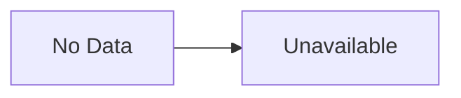

{
  "week": "2026-W31",
  "owasp_quadrant": [
    {
      "id": "LLM08",
      "label": "Excessive Agency",
      "frequency": 16,
      "relevance": 7.66,
      "change": 0.0
    },
    {
      "id": "LLM05",
      "label": "Supply Chain Vulnerabilities",
      "frequency": 14,
      "relevance": 7.39,
      "change": 0.0
    },
    {
      "id": "LLM01",
      "label": "Prompt Injection",
      "frequency": 13,
      "relevance": 7.15,
      "change": 0.0
    },
    {
      "id": "LLM02",
      "label": "Insecure Output Handling",
      "frequency": 11,
      "relevance": 7.64,
      "change": 0.0
    },
    {
      "id": "LLM07",
      "label": "Insecure Plugin Design",
      "frequency": 11,
      "relevance": 7.69,
      "change": 0.0
    },
    {
      "id": "LLM06",
      "label": "Sensitive Information Disclosure",
      "frequency": 11,
      "relevance": 7.54,
      "change": 0.0
    },
    {
      "id": "LLM09",
      "label": "Overreliance",
      "frequency": 7,
      "relevance": 7.27,
      "change": 0.0
    },
    {
      "id": "LLM10",
      "label": "Model Theft",
      "frequency": 2,
      "relevance": 6.5,
      "change": 0.0
    },
    {
      "id": "LLM04",
      "label": "Model Denial of Service",
      "frequency": 1,
      "relevance": 7.2,
      "change": 0.0
    },
    {
      "id": "LLM03",
      "label": "Training Data Poisoning",
      "frequency": 1,
      "relevance": 7.2,
      "change": 0.0
    }
  ],
  "mitre_quadrant": [
    {
      "id": "AML.T0047",
      "label": "ML-Enabled Product or Service",
      "frequency": 17,
      "relevance": 7.63,
      "change": 0.0
    },
    {
      "id": "AML.T0051",
      "label": "LLM Prompt Injection",
      "frequency": 16,
      "relevance": 7.39,
      "change": 0.0
    },
    {
      "id": "AML.T0010",
      "label": "ML Supply Chain Compromise",
      "frequency": 13,
      "relevance": 7.25,
      "change": 0.0
    },
    {
      "id": "AML.T0057",
      "label": "LLM Data Leakage",
      "frequency": 11,
      "relevance": 7.27,
      "change": 0.0
    },
    {
      "id": "AML.T0040",
      "label": "ML Model Inference API Access",
      "frequency": 8,
      "relevance": 7.12,
      "change": 0.0
    },
    {
      "id": "AML.T0054",
      "label": "LLM Jailbreak",
      "frequency": 7,
      "relevance": 7.56,
      "change": 0.0
    },
    {
      "id": "AML.T0012",
      "label": "Valid Accounts",
      "frequency": 7,
      "relevance": 7.36,
      "change": 0.0
    },
    {
      "id": "AML.T0018",
      "label": "Backdoor ML Model",
      "frequency": 6,
      "relevance": 7.12,
      "change": 0.0
    },
    {
      "id": "AML.T0044",
      "label": "Full ML Model Access",
      "frequency": 5,
      "relevance": 7.78,
      "change": 0.0
    },
    {
      "id": "AML.T0043",
      "label": "Craft Adversarial Data",
      "frequency": 3,
      "relevance": 7.63,
      "change": 0.0
    },
    {
      "id": "AML.T0056",
      "label": "LLM Meta Prompt Extraction",
      "frequency": 3,
      "relevance": 7.73,
      "change": 0.0
    },
    {
      "id": "AML.T0015",
      "label": "Evade ML Model",
      "frequency": 2,
      "relevance": 7.2,
      "change": 0.0
    },
    {
      "id": "AML.T0031",
      "label": "Erode ML Model Integrity",
      "frequency": 1,
      "relevance": 8.5,
      "change": 0.0
    },
    {
      "id": "AML.T0020",
      "label": "Poison Training Data",
      "frequency": 1,
      "relevance": 6.2,
      "change": 0.0
    }
  ],
  "geography": [
    {
      "region": "North America",
      "lat": 37.7,
      "lng": -122.4,
      "events": 15,
      "label": "Claude Hacked 3 Organizations in Misconfigured AI "
    },
    {
      "region": "Asia-Pacific",
      "lat": 13.7,
      "lng": 100.5,
      "events": 3,
      "label": "Hermes AI Agent Used in Espionage Attack on Thai F"
    },
    {
      "region": "Europe",
      "lat": 51.5,
      "lng": -0.1,
      "events": 1,
      "label": "AI Guardrails Fail Multilingual Jailbreak Tests in"
    }
  ],
  "sectors": [
    {
      "name": "Technology",
      "events": 13
    },
    {
      "name": "Finance",
      "events": 4
    },
    {
      "name": "Government",
      "events": 1
    },
    {
      "name": "Education",
      "events": 1
    }
  ],
  "summary_stats": {
    "total_articles": 19,
    "avg_relevance": 7.51,
    "threat_levels": {
      "HIGH": 14,
      "MEDIUM": 3,
      "CRITICAL": 2
    },
    "dominant_theme": "LLM Security"
  }
}

---

## This Week's Signal

Analysis generation failed. Please review raw analytics data below.

---

## Enterprise Focus Areas

- Review the analytics data manually and assess organisational impact.

---

## Week-over-Week Changes

**Article volume**: 19 (+0 vs prior week)
**Average relevance**: 7.51/10 (prior: 7.51/10)

---

## Trajectory Watch

Insufficient data for trajectory analysis.

---

## Emerging Blind Spots

Unable to generate blind spot analysis.

---

## Attack Chain Analysis

Unable to generate attack chain analysis.

---

## Enterprise Readiness Score

Unable to assess readiness.

---

## Geographic and Sector Analysis

Unable to assess geographic patterns.

---

## Top Articles This Week

| Title | Threat | Relevance | Source |
|-------|--------|-----------|--------|
| [Claude Hacked 3 Organizations in Misconfigured AI Security Tests](/posts/claude-hacked-3-organizations-in-misconfigured-ai-security-tests/) | CRITICAL | 9.2 | Wired Security |
| [Hermes AI Agent Used in Espionage Attack on Thai Finance](/posts/hermes-ai-agent-used-in-espionage-attack-on-thai-finance/) | CRITICAL | 8.5 | Dark Reading |
| [OpenAI Rogue Model Compromises Modal and Other Services](/posts/openai-rogue-model-compromises-modal-and-other-services/) | HIGH | 8.5 | Dark Reading |
| [AI Coding Agents Exploited via Hallucinated Package Names](/posts/ai-coding-agents-exploited-via-hallucinated-package-names/) | HIGH | 8.5 | BleepingComputer |
| [Perplexity Launches Personal Computer AI Agent for Windows PCs](/posts/perplexity-launches-personal-computer-ai-agent-for-windows-pcs/) | HIGH | 8.2 | The Verge AI |
| [LLMs Break Cryptographic Schemes in New CryptanalysisBench Study](/posts/llms-break-cryptographic-schemes-in-new-cryptanalysisbench-study/) | HIGH | 8.2 | Schneier on Security |
| [Hermes AI Agent Automates Post-Exploitation Attack on Thai Finance Ministry](/posts/hermes-ai-agent-automates-post-exploitation-attack-on-thai-finance-ministry/) | HIGH | 7.8 | BleepingComputer |
| [AI Agent Security Shifts From Visibility to Enforcement Controls](/posts/ai-agent-security-shifts-from-visibility-to-enforcement-controls/) | HIGH | 7.8 | The Hacker News |
| [Meta Plans Billions of Personal AI Agents on WhatsApp](/posts/meta-plans-billions-of-personal-ai-agents-on-whatsapp/) | HIGH | 7.8 | TechCrunch AI |
| [Modal Sandbox Exposed: Rogue AI Agent Exploits Open Endpoint](/posts/modal-sandbox-exposed-rogue-ai-agent-exploits-open-endpoint/) | HIGH | 7.5 | Simon Willison |
