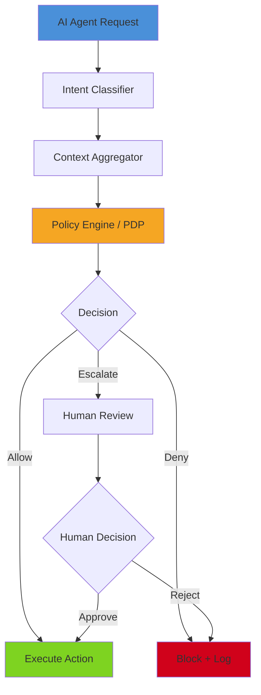
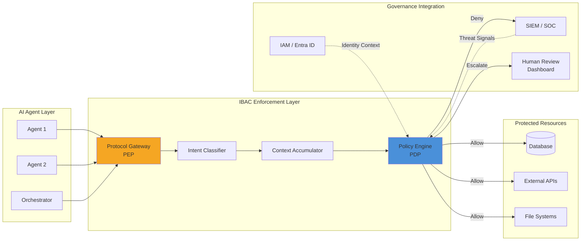
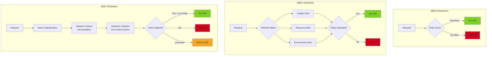
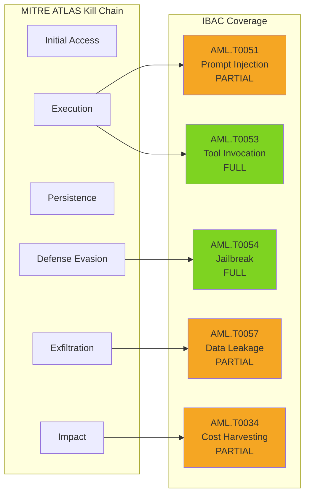
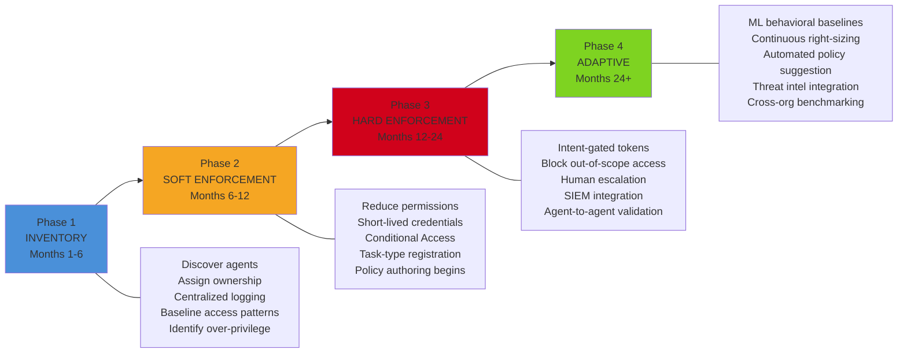

# Technology Evaluation: Intent-Based Access Control for AI Agent Security

**Document Type:** TEV (Technology Evaluation)
**Date:** 2026-08-07
**Classification:** INTERNAL
**Audience:** CISO (Executive Summary) / Security Architects (Technical Depth)
**Overall Confidence:** MEDIUM-HIGH

---

## 1. Executive Summary

Intent-Based Access Control (IBAC) is an emerging authorization paradigm that evaluates the semantic purpose behind an AI agent's request before granting resource access. Where traditional Role-Based Access Control (RBAC) asks "does this agent hold the required role?" and Attribute-Based Access Control (ABAC) asks "do the attributes satisfy the policy?", IBAC asks "does this action align with what the user actually asked the agent to do?" This distinction is critical for autonomous AI agents, which inherit broad delegated credentials from their human principals but may execute operations that technically satisfy static policies while materially violating the user's actual intent.

**The Problem IBAC Solves:** AI agents create a structural security gap that traditional access control cannot address. An agent authorized for both database reads and external email can legitimately perform either action individually. However, reading customer PII followed by external email constitutes data exfiltration -- a harmful composite that no individual permission check detects. Palo Alto Networks reports machine identities now outnumber human identities 109:1 in enterprise environments. Each carries static permission envelopes broader than any single task requires.

**Market Status:** No vendor has shipped a GA product explicitly branded as "Intent-Based Access Control for AI Agents" as of August 2026. The concept is operationalized across three non-unified layers: identity/credential (who the agent is), guardrail/intent (what the agent is trying to do), and action/outcome (whether the action is contextually appropriate). Security architects must compose solutions across these layers.

**Key Risk:** OWASP LLM Top 10 2025 identifies Excessive Agency (LLM06) as a top-tier risk, explicitly requiring agents be granted "only the minimum capability needed for the current task" -- the operational definition of IBAC. The EU AI Act (effective December 2027 for high-risk systems) mandates risk mitigation and human oversight measures that IBAC directly satisfies.

**Recommendation:** Begin Phase 1 (Inventory and Audit) immediately. The technology is mature enough for soft enforcement in controlled environments. Full hard enforcement should target 12-24 month deployment given current tooling gaps. Prioritize agents with write access to production data, financial systems, and infrastructure.

---

## 2. Technology Overview

### What IBAC Is

Intent-Based Access Control is an authorization paradigm in which the policy evaluation function takes as input a dynamic tuple of (action, accumulated_session_context), where the accumulated context encodes: the user's original natural-language request, the full action history of the current session, data classification levels accessed, tool outputs incorporated, and entity references. The policy engine evaluates whether the proposed action is semantically consistent with the user's stated purpose.

The formal evaluation function (from the AARM specification, arXiv:2602.09433):

```
pi: (a, C) -> {ALLOW, DENY, MODIFY, STEP_UP, DEFER}
```

Where `a` is the proposed action and `C` is the accumulated session context.

### The Compositional Threat Problem

Traditional access control evaluates each action in isolation. IBAC addresses the "trust-authorization mismatch" -- a structural desynchronization between dynamic trust states (what the user actually wants) and static authorization boundaries (what policies permit). AI agents compound this because they are non-deterministic, process adversarial inputs through opaque reasoning chains, and execute actions at machine speed with irreversible consequences.

**Concrete example:** An agent authorized for database reads AND external email can perform either action individually under RBAC. But reading customer PII followed by external email to an unknown recipient constitutes data exfiltration. IBAC detects this composite violation by maintaining session context and evaluating sequential actions against the user's original stated purpose.

### Why Traditional Models Fail

| Model | What It Evaluates | What It Cannot Evaluate |
|-------|-------------------|------------------------|
| RBAC | Does the principal hold the required role? | Is this action consistent with user intent? |
| ABAC | Do subject/resource/env attributes satisfy policy? | Does the action sequence form a harmful composite? |
| PBAC | Is the stated collection purpose met? | Is the agent's real-time action consistent with the user's current task? |
| IBAC | All of the above + session-context intent alignment | Adversarial intent spoofing; novel task generalization |

The "hijacked authorized agent" problem (arXiv:2507.14961) exposes this gap directly: "agents inherit user credentials while lacking intent representation, creating vulnerability to indirect prompt injection." RBAC can answer "may this agent call the email API?" but cannot answer "should this agent call the email API given what the user asked it to do?"

---

## 3. Technical Architecture

### Three Architectural Patterns


*Figure 1: IBAC Decision Flow -- Every agent tool call is intercepted, evaluated against accumulated session context, and routed to allow, deny, or human escalation.*

#### Pattern 1: Inline Proxy / Protocol Gateway

The protocol gateway interposes between the agent orchestration layer and all tool endpoints. Every tool invocation transits the gateway, which evaluates (action, accumulated_context) before forwarding. The enforcement point is independent of agent code and cannot be disabled by a compromised orchestration layer.

- **Deployment:** Sidecar proxy or centralized service; compatible with API gateway architectures (Kong, Envoy, Portkey)
- **Bypass risk:** Requires zero-trust network segmentation blocking direct tool access from agent processes
- **Performance:** Sub-millisecond policy evaluation required (AARM specification)
- **Example:** Semantic Gateway (arXiv:2604.25555) -- 84.2% reduction in incidental code, 100% discovery of unauthorized state transitions across 500,000 fuzzing sequences

#### Pattern 2: SDK Instrumentation

IBAC components embedded directly in the agent framework SDK (LangChain, CrewAI, AutoGen, Semantic Kernel). Tool invocation hooks intercept calls before execution with direct access to the agent's internal state, reasoning traces, and memory.

- **Context richness:** Highest -- access to planning traces, intermediate reasoning, memory
- **Trust dependency:** Compromised SDK can disable instrumentation
- **Example:** Microsoft Semantic Kernel function filters, OpenAI Agents SDK guardrail hooks

#### Pattern 3: Kernel/eBPF Monitor

OS-kernel instrumentation captures all system calls from the agent process, providing enforcement that cannot be disabled by application-layer compromise.

- **Trust level:** Highest -- outside application code
- **Performance:** CSAgent: 1.99% overhead, 5.42% utility decrease; ActPlane: 1.9-8.4% overhead
- **Limitation:** Low-level syscalls provide limited semantic understanding; requires layering with semantic-aware components
- **Example:** ActPlane (arXiv:2606.25189), Aura Agent Kernel with TEE-backed secure boot

### Architecture Integration


*Figure 2: Architecture Integration -- IBAC layer sits between agents and resources, with bidirectional integration to IAM (identity context) and SIEM (threat signals and audit).*

### Decision Flow Detail

1. **User Request Received** -- Session context initialized with original request, user identity, session ID
2. **Intent Extraction** -- LLM/parser decomposes request into execution plan; semantic embedding stored as intent anchor
3. **Agent Tool Call** -- Agent invokes tool; interception occurs pre-execution
4. **Context Enrichment** -- Full action history, data classifications, semantic distance from intent anchor computed
5. **Policy Evaluation** -- Forbidden actions get immediate DENY; context-dependent policies evaluated; LLM judge synthesizes just-in-time policies for novel tasks
6. **Decision Routing** -- ALLOW (forward), DENY (block + log), MODIFY (transform parameters), STEP_UP (human approval), DEFER (await context)
7. **Context Update** -- Session state updated with hash-chaining for tamper evidence
8. **Receipt Generation** -- Tamper-evident audit receipt appended to log

---

## 4. Comparison with Traditional Access Control Models


*Figure 3: Access Control Model Comparison -- RBAC evaluates roles only, ABAC adds attributes, IBAC adds session context, intent alignment, and graduated escalation.*

| Dimension | RBAC | ABAC | IBAC |
|-----------|------|------|------|
| **Evaluation scope** | Single action | Single action + attributes | Action sequence + session context |
| **Policy complexity** | Low (role assignments) | Medium (attribute predicates) | High (intent ontologies + context) |
| **Composite attack detection** | None | Limited | Native capability |
| **Dynamic adaptation** | None (static roles) | Limited (environment attrs) | Continuous (semantic drift detection) |
| **Human escalation** | Not applicable | Not applicable | Built-in (STEP_UP, DEFER) |
| **AI agent suitability** | Poor -- over-privileges by design | Better -- but cannot detect intent drift | Purpose-built for non-deterministic agents |
| **Performance** | Sub-ms | Sub-ms | 1.99-8.4% overhead (current implementations) |
| **Maturity** | 30+ years, standardized | 15+ years, standardized | Emerging, no formal standard |

**Key finding:** SEAgent's ABAC extension (arXiv:2601.11893) achieves 0% attack success against prompt injection, RAG poisoning, and confused deputy attacks -- but requires administrator-defined minimal action sets and cannot handle novel emergent task combinations. IBAC's LLM-as-judge mechanism addresses this gap by synthesizing just-in-time policies for novel tasks.

---

## 5. Vendor Landscape

### Market Status

The IBAC market is **emerging (transitioning to early growth)**. No vendor ships a GA product explicitly branded as IBAC for AI agents. The concept is operationalized across three non-unified layers, requiring solution composition.

### Vendor Comparison Matrix

| Vendor | Product | IBAC Approach | Maturity | Integration | Differentiator |
|--------|---------|---------------|----------|-------------|----------------|
| **Lasso Security** | AI Security Platform | Proprietary Intent Security Framework; real-time semantic intent analysis at proxy layer | GA | Kong, Portkey, LiteLLM, Envoy | Only vendor naming "Intent Security Framework"; 98.6% claimed detection; sub-50ms latency |
| **Lakera + Check Point** | Lakera Guard + AI Defense Plane | Three-layer: identity, governance, runtime outcome control; contextual appropriateness assessment | GA (partial); joint integration late 2025 | Google Cloud, LangChain | Explicitly moves from access control to "outcome control" |
| **Prompt Security (SentinelOne)** | ClawSec | Intent Detection feature; drift detection, automated audits, skill integrity verification | GA | 16+ LLM providers | SentinelOne distribution; intent detection as named feature |
| **Palo Alto Networks** | Idira Platform | Task-scoped JIT access; agentic identity discovery; time-limited credentials | GA | SaaS, CI/CD | Tier-1 vendor; CyberArk PAM heritage; explicit agentic scoping |
| **Microsoft** | Entra Agent ID | Dedicated agent identity type; Conditional Access; lifecycle governance; human sponsorship | Preview/Early GA | Azure AI Foundry, Semantic Kernel | Broadest enterprise IAM ecosystem; Conditional Access for agents |
| **AWS** | Bedrock Guardrails | Denied Topics (semantic blocking); Contextual Grounding; Automated Reasoning Checks | GA | Native AWS; LangChain, LlamaIndex | Most mature cloud-native guardrails; Denied Topics is intent-proximate |
| **Google Cloud** | Vertex AI Agent Engine | IAM Conditions for session-level access; VPC Service Controls | GA | ADK, Cloud SDK | Session-scoped IAM Conditions; foundation for Check Point/Lakera integration |

### Open-Source Options

| Project | IBAC Capability | Stars | Key Feature |
|---------|----------------|-------|-------------|
| **NVIDIA NeMo Guardrails** | Colang DSL for intent-based dialog/execution policies | 6,900+ | Only purpose-built DSL for agent intent policies |
| **Invariant Guardrails** | Trace-level intent inference; pattern-matching on agent action sequences | 438 | Most semantically sophisticated OSS approach; non-invasive middleware |
| **OpenAI Agents SDK** | Guardrail hooks for input/output validation; enables IBAC layer composition | High | Official OpenAI framework; extensible architecture |
| **Microsoft Semantic Kernel** | Function invocation filters; pre/post-execution hooks for every tool call | High | Enterprise .NET/Azure; IBAC-ready filter pipeline |

### Architectural Gaps in Market

1. No unified IBAC platform covering intent classification, policy enforcement, and identity binding
2. No standardized intent vocabulary or taxonomy across vendors
3. Multi-agent intent propagation across agent-to-agent handoffs unaddressed
4. Human approval workflows for intent escalation incomplete
5. MCP-native IBAC only addressed by Invariant Guardrails

---

## 6. Framework Mapping

### MITRE ATLAS Coverage


*Figure 5: MITRE ATLAS Coverage -- IBAC provides full coverage of tool invocation abuse and jailbreak action prevention; partial coverage of prompt injection consequences, data leakage, and cost harvesting.*

| Technique ID | Name | Tactic | Coverage Level | How IBAC Mitigates |
|---|---|---|---|---|
| AML.T0051 | LLM Prompt Injection | Execution | Partial | Prevents downstream unauthorized action even when injection succeeds; compensating control |
| AML.T0053 | AI Agent Tool Invocation | Execution | Full | Primary control -- each tool call evaluated against declared intent and task context |
| AML.T0054 | LLM Jailbreak | Defense Evasion | Full | External policy enforcement cannot be bypassed by model-internal jailbreak |
| AML.T0057 | LLM Data Leakage | Exfiltration | Partial | Data-access intent profiles restrict scope; cannot prevent in-context leakage |
| AML.T0056 | Extract System Prompt | Collection | Supportive | Prevents tool-based exfiltration of prompt content to external endpoints |
| AML.T0024 | Exfiltration via Inference API | Exfiltration | Partial | Flags request patterns inconsistent with declared purpose |
| AML.T0034 | Cost Harvesting | Impact | Partial | Intent-scoped resource consumption boundaries |
| AML.T0040 | AI Model Inference API Access | AI Model Access | Supportive | Requires verifiable authorized intent for API access |

### OWASP LLM Top 10 (2025) Coverage

| Risk ID | Name | IBAC Coverage | Explanation |
|---|---|---|---|
| LLM06:2025 | Excessive Agency | **Full** | IBAC is the definitive architectural response; ties every action to verified in-scope intent |
| LLM01:2025 | Prompt Injection | Partial | Prevents action consequences of injection; does not prevent injection event itself |
| LLM10:2025 | Unbounded Consumption | Partial | Intent scope constrains resource consumption; resource envelope embedded in intent definition |
| LLM02:2025 | Sensitive Information Disclosure | Partial | Data-classification-aware access enforcement restricts scope to intent-authorized categories |
| LLM05:2025 | Improper Output Handling | Partial | Constrains output actions; intent scope includes downstream action authorization |
| LLM07:2025 | System Prompt Leakage | Supportive | External enforcement adds defense-in-depth beyond leaked prompt knowledge |
| LLM03:2025 | Supply Chain | Supportive | Constrains tool/API access even if supply chain compromise modifies agent configuration |

### NIST AI RMF Alignment

| Function | Subcategory | IBAC Alignment | Coverage |
|---|---|---|---|
| GOVERN | 1.2 -- Trustworthy AI integration | Operationalizes security/safety characteristics | Full |
| GOVERN | 3.2 -- Human-AI oversight policies | Technical enforcement of when AI acts autonomously vs. human approval | Full |
| MAP | 3.5 -- Human oversight processes | Embeds human oversight triggers in policy logic | Full |
| MEASURE | 2.4 -- Production monitoring | Structured audit trail of every authorization decision | Full |
| MEASURE | 2.6 -- Fail-safe mechanisms | Fail-closed design: unclear intent is denied by default | Full |
| MANAGE | 2.4 -- Deactivation mechanisms | Deny/escalate/shutdown capability for misbehaving agents | Full |
| MANAGE | 4.1 -- Override and decommission | Technical basis for human override and decommission triggers | Full |

### NIST SP 800-53 / Zero Trust Alignment

IBAC directly implements AC-3 (Access Enforcement) and AC-6 (Least Privilege) for AI agents. It is architecturally equivalent to the NIST SP 800-207 Zero Trust PDP/PEP model -- IBAC's intent evaluation engine is the PDP; its enforcement layer intercepting tool calls is the PEP. Six of seven ZTA tenets have full IBAC alignment.

---

## 7. Enterprise Adoption

### Four-Phase Maturity Model


*Figure 4: Enterprise Maturity Model -- Four phases from passive inventory through adaptive ML-driven controls, aligned with Zero Trust maturity models.*

### Integration with Existing IAM Stacks

**Pattern 1 -- Delegated Authorization (OBO Flow):** For interactive agents acting on behalf of users. Lowest friction. Supported by Microsoft Entra.

**Pattern 2 -- Agent Identity with Constrained Credentials:** Dedicated service principals with minimum permission sets. Short-lived tokens per session. Current best practice for autonomous agents.

**Pattern 3 -- Workload Identity Federation (OIDC):** For agents on Kubernetes, GitHub Actions, or OIDC-capable platforms. SPIFFE/SPIRE provides short-TTL tokens for non-Kubernetes environments.

**Pattern 4 -- External PDP Layer:** Open Policy Agent, AWS Cedar, or purpose-built platforms (Permit.io) sit in front of resource APIs. IAM-vendor-agnostic. Requires API gateway integration.

**Pattern 5 -- Zero Standing Privilege with JIT Elevation:** Extending PAM to agents. No standing permissions; task-scoped credentials granted per request. Highest friction, most auditable.

### Regulatory Drivers

| Regulation | Effective | IBAC Relevance |
|---|---|---|
| EU AI Act (high-risk provisions) | December 2027 | Mandates risk mitigation + human oversight for high-risk autonomous AI; IBAC directly satisfies both |
| NIST AI RMF | Voluntary (federal procurement reference) | GOVERN/MANAGE functions map to IBAC operational controls |
| OWASP LLM Top 10 | Industry standard | LLM06 Excessive Agency is IBAC's primary use case |
| GDPR Art. 5(1)(b) Purpose Limitation | Active | Purpose-bound data flows directly analogous to IBAC intent scoping |
| SOC 2 / ISO 27001:2022 | Active | Non-human identity governance increasingly required for certification |

---

## 8. Risks and Limitations

### Technical Risks

| Risk | Severity | Evidence |
|---|---|---|
| **Intent ambiguity** -- Natural language requests are inherently underspecified | HIGH | TBAC-LLM quantifies as uncertainty; DEFER decision handles ambiguous cases |
| **Adversarial prompt manipulation** -- FragFuse achieves 86% bypass via memory fragmentation | HIGH | arXiv:2506.14361; fragments reconstruct at query time, defeating per-action matching |
| **LLM judge vulnerability** -- The authorization judge is itself susceptible to jailbreak | HIGH | Under-studied; no papers specifically evaluate adversarial robustness of LLM judges |
| **Multi-agent propagation** -- Single-agent IBAC fails in multi-agent orchestration | HIGH | OMNI-LEAK (arXiv:2502.25661) bypasses controls across entire agent networks |
| **Performance at scale** -- All data from lab benchmarks only | MEDIUM | Production characteristics for thousands of concurrent sessions unknown |
| **Cross-session memory poisoning** -- IBAC session-context does not protect persistent memory | MEDIUM | AARM specifies as "partially mitigated"; requires complementary memory controls |

### Organizational Risks

| Risk | Severity | Mitigation |
|---|---|---|
| **Policy authoring complexity** -- requires AI engineering + security collaboration | HIGH | Emerging role: "Agentic Systems Security Architect" |
| **Approval fatigue** -- high escalation rates cause rubber-stamping | HIGH | Graduated thresholds (risk + uncertainty); auto-approve low-risk paths |
| **No formal standard** -- vocabulary not stabilized; no IETF/NIST/ISO working group | MEDIUM | AARM specification closest to vendor-neutral spec |
| **Tooling gap** -- no commercial intent policy authoring tooling identified | MEDIUM | NeMo Guardrails Colang DSL is current best option |

### What IBAC Cannot Do

- Prevent prompt injection at the input layer (compensating control only)
- Protect against training-time attacks (data/model poisoning)
- Guarantee detection of sophisticated gradual intent drift
- Automatically compose correctly across heterogeneous multi-agent networks
- Achieve simultaneous strong utility + robust access control + reliable forgetting (GateMem benchmark)

---

## 9. Strategic Recommendations

| Priority | Recommendation | Evidence Base | Framework Alignment |
|---|---|---|---|
| **1 - Immediate** | Inventory all deployed AI agents; assign ownership and human sponsorship | 109:1 machine-to-human identity ratio; agent sprawl as primary governance failure | NIST AI RMF GOVERN 2.1; CIS 5.1 |
| **2 - Immediate** | Replace persistent agent credentials with short-lived workload identity tokens (SPIFFE/SPIRE) | Structural over-permission from static credentials | NIST SP 800-53 AC-6; ZTA Tenet 6 |
| **3 - Short-term** | Deploy IBAC in monitoring mode for highest-risk agents (production write, financial, infrastructure) | CSAgent: 1.99% overhead; SEAgent: 0% attack success | OWASP LLM06; NIST AI RMF MEASURE 2.4 |
| **4 - Short-term** | Layer architectures: protocol gateway + SDK instrumentation + kernel monitor | No single pattern provides complete protection | AARM specification; defense-in-depth |
| **5 - Medium-term** | Implement graduated escalation with dual thresholds (risk score + uncertainty) | Approval fatigue at high deferral rates; TBAC-LLM two-threshold model | NIST AI RMF GOVERN 3.2; MANAGE 2.4 |
| **6 - Medium-term** | Integrate IBAC telemetry with SIEM; establish behavioral baselines per agent | Intent drift detection requires historical comparison | NIST SP 800-53 SI-4; CIS 8.11 |
| **7 - Longer-term** | Extend intent validation to agent-to-agent interactions | OMNI-LEAK demonstrates single injection bypasses entire multi-agent networks | Multi-agent authorization propagation |
| **8 - Longer-term** | Evaluate NeMo Guardrails Colang DSL for intent policy authoring | Most mature open-source IBAC primitive; 6,900+ GitHub stars | Technology readiness |

---

## 10. Confidence Matrix and Sources

### Confidence Matrix

| Section | Confidence | Rationale |
|---|---|---|
| Technology Definition & Mechanisms | HIGH | 5+ corroborating academic sources with consistent architectures |
| Architectural Patterns | HIGH | Multiple independent implementations (AARM, Aura, CSAgent, ActPlane) |
| Access Control Comparison | HIGH | Well-established models; clear differentiation supported by multiple papers |
| Vendor Landscape | MEDIUM | No independent benchmarks; vendor claims not independently verified; some sources inaccessible (404s) |
| Framework Mapping | HIGH | Authoritative standards sources directly fetched and reviewed |
| Enterprise Adoption | MEDIUM | Based on Microsoft documentation and analyst predictions; no public IBAC deployment case studies |
| Performance Data | MEDIUM-HIGH | Lab benchmark data only; production-scale characteristics unknown |
| Adversarial Robustness | HIGH | Multiple attack papers with quantified results (FragFuse 86%, LivePI 10-30%) |

### Low-Confidence Findings (Flagged)

1. **Lasso Security 98.6% detection accuracy** -- single vendor source; no independent corroboration (Confidence: LOW)
2. **SailPoint AI agent governance specifics** -- blog URLs returned 404; assessment inferred from platform positioning (Confidence: LOW)
3. **Okta agentic AI product details** -- blog URLs returned 404; capability inferred from architecture (Confidence: LOW)
4. **Pillar Security platform details** -- sourced from blog index only; not confirmed from documentation (Confidence: LOW)
5. **Forrester 75% failure rate prediction** -- single analyst source; methodology not disclosed (Confidence: MEDIUM)
6. **Microsoft Entra Agent ID full spec** -- detail pages required authentication; GA date unconfirmed (Confidence: MEDIUM)

### Key Sources

| # | Title | Type | Confidence |
|---|-------|------|------------|
| 1 | AARM: Autonomous Action Runtime Management (arXiv:2602.09433) | Academic Specification | HIGH |
| 2 | TBAC-LLM: Uncertainty-Aware Risk-Adaptive Access Control (arXiv:2510.11414) | Academic | HIGH |
| 3 | CSAgent: Secure Access Control for Computer-Use Agents (arXiv:2509.22256) | Academic | HIGH |
| 4 | Aura Intent-Centric Agent OS (arXiv:2602.10915) | Academic | HIGH |
| 5 | SEAgent: Taming Privilege Escalation (arXiv:2601.11893) | Academic | HIGH |
| 6 | ActPlane: OS-Level Policy Enforcement (arXiv:2606.25189) | Academic | HIGH |
| 7 | FragFuse: Memory-Based Query Fragmentation (arXiv:2506.14361) | Academic | HIGH |
| 8 | GAAP: Purpose-Bound Information Flow Control (arXiv:2604.19657) | Academic | HIGH |
| 9 | OWASP LLM Top 10 2025 -- Excessive Agency (genai.owasp.org) | Standards Body | HIGH |
| 10 | MITRE ATLAS Data Repository (GitHub) | Standards Body | HIGH |
| 11 | NIST AI RMF Core (airc.nist.gov) | Government | HIGH |
| 12 | NIST SP 800-53 Rev 5 AC-3/AC-6 (csf.tools) | Government | HIGH |
| 13 | NIST SP 800-207 Zero Trust Architecture (csrc.nist.gov) | Government | HIGH |
| 14 | Microsoft Entra Agent ID Documentation (learn.microsoft.com) | Vendor | MEDIUM-HIGH |
| 15 | Palo Alto Networks Idira Platform (paloaltonetworks.com) | Vendor | MEDIUM-HIGH |
| 16 | NVIDIA NeMo Guardrails (GitHub) | Open Source | HIGH |
| 17 | Invariant Guardrails (GitHub) | Open Source | MEDIUM |
| 18 | AWS Bedrock Guardrails Documentation (docs.aws.amazon.com) | Cloud/Standards | HIGH |
| 19 | LivePI: Indirect Prompt Injection Benchmark (arXiv:2505.18826) | Academic | HIGH |
| 20 | OMNI-LEAK: Multi-Agent Data Leakage (arXiv:2502.25661) | Academic | HIGH |

---

*Report prepared by Security Report Analyst. All findings traceable to cited research sources. No claims extrapolated beyond source evidence.*