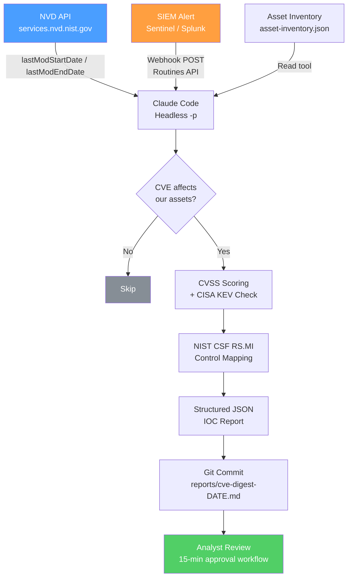

## Why This Matters — A Note for CISOs

Security teams have been promised "AI automation" for three years. What they have received, largely, are chatbots that require copy-pasting logs into a browser tab, inline code suggestion tools that have no concept of a SIEM, and copilot products that excel at fixing a SQL injection in a single file but cannot help an analyst write a structured incident advisory and commit it to a repository.

Claude Code is a different category of tool. It is an agentic command-line interface — available at `claude.ai/code` as a SaaS product and installable via `npm install -g @anthropic-ai/claude-code` — that can read files, execute shell commands, call external APIs, spawn specialized sub-agents, and schedule recurring autonomous workflows, all from a terminal. The distinction that matters for your security team is not that it uses a more capable language model. It is that it operates as an orchestrator inside your existing toolchain, not as a destination you route queries to.

For a SOC analyst, the practical difference is this: instead of opening a browser tab, pasting 200 log lines, reading a response, and manually writing up findings, the analyst opens a terminal, scopes the session to the current engagement using a configuration file, and instructs Claude Code to pull the last 24 hours of alerts from Sentinel via the Azure CLI, cross-reference CVEs against the NVD feed, and produce a prioritized advisory in the format your team already uses. Claude Code executes each step, asks for permission before running anything with side effects, and produces a git-committable output. The analyst reviews and approves; the legwork is delegated.

One concrete anchor: the NVD CVE REST API (v2.0) at `services.nvd.nist.gov/rest/json/cves/2.0` supports incremental polling via `lastModStartDate` and `lastModEndDate` parameters with 2,000-result pagination and up to 120-day lookback windows. Claude Code's headless mode can pipe that feed directly into structured, schema-validated JSON output. This is a documented, working integration pattern — covered in full below.

**Before anything else: the privacy boundary is sharp.** Consumer Claude accounts (Free, Pro, Max) are subject to Anthropic's training data model — your analysts' CVE research, incident data, and compliance evidence can enter training pipelines unless opted out, and even with opt-out enabled, safety-flagged content is retained for up to two years. For any real security work, the Team, Enterprise, or API tier is the minimum. Commercial terms include a Data Processing Addendum under which Anthropic explicitly does not train on customer content. For organizations with data residency requirements — GDPR, sovereign cloud, FedRAMP — the answer is AWS Bedrock or Google Vertex AI, covered in the hardening section below.

---

## Core Capabilities for Security Teams

### Agentic Shell Execution and Sub-agents

Claude Code's official documentation describes it as "an agentic coding tool that reads your codebase, edits files, runs commands, and integrates with your development tools." That understates the security use case. The more relevant framing for analysts: it is a Unix-philosophy orchestrator — composable, pipeable, chainable with existing CLI tools.

The sub-agent architecture is where this becomes genuinely useful for multi-step security tasks. Each sub-agent runs in its own context window with a custom system prompt, specific tool access, and independent permissions. In practice, this means you can define a `cve-analyst` sub-agent scoped to `Read`, `Bash`, and `WebFetch` tools, running on the cheaper Haiku model, whose only job is to parse CVE JSON records and return structured summaries. The main session stays clean; the sub-agent handles the verbosity of processing hundreds of records. The official documentation provides a `security-reviewer` sub-agent example verbatim:

```markdown
---
name: security-reviewer
description: Reviews code for security vulnerabilities
tools: Read, Grep, Glob, Bash
model: opus
---
You are a senior security engineer. Review code for:
- Injection vulnerabilities (SQL, XSS, command injection)
- Authentication and authorization flaws
- Secrets or credentials in code
- Insecure data handling

Provide specific line references and suggested fixes.
```

### MCP Protocol — Integration with Security Tooling

MCP (Model Context Protocol) is an open standard that lets Claude Code connect to external data sources and tools. The promise for security teams is obvious: a Splunk MCP server that Claude Code can query directly, or a Sentinel connector that accepts KQL queries from inside the session.

The honest state of play as of mid-2026: **those servers do not yet exist in any official or production-grade form.** The official `modelcontextprotocol/servers` repository contains seven general-purpose reference servers — Fetch, Filesystem, Git, Memory, Sequential Thinking, Time, and Everything — none of which are security-specific. The GitHub `mcp-server-security` topic returns repositories focused on MCP framework security itself, not SIEM integration.

The practical workaround, and the one Claude Code's own documentation recommends for well-supported CLI tools, is to use the Bash tool directly with existing command-line interfaces:

```bash
# Microsoft Sentinel via Azure CLI
az monitor log-analytics query \
  --workspace "$SENTINEL_WORKSPACE_ID" \
  --analytics-query "SecurityIncident | where TimeGenerated > ago(24h) \
    | project IncidentName, Severity, Status" \
  | claude -p "Summarize open incidents, prioritize by severity, \
    recommend immediate response actions" \
  --output-format json

# Microsoft Defender via Microsoft Graph REST
curl -H "Authorization: Bearer $MS_GRAPH_TOKEN" \
  "https://graph.microsoft.com/v1.0/security/alerts_v2?\$filter=status eq 'active'" \
  | claude -p "Triage these Defender alerts and suggest response playbook steps"

# Splunk via Splunk CLI
splunk search "index=security earliest=-24h" -output json \
  | claude -p "Identify anomalous patterns, classify by MITRE ATT&CK tactic, output JSON"
```

Teams willing to invest in development can build a custom MCP server using the TypeScript or Python MCP SDK, which would expose Splunk SPL queries or Sentinel KQL as MCP tools discoverable by Claude. That is the right long-term architecture; the CLI wrapper approach is the right short-term one.

One enterprise control worth noting: `allowManagedMcpServersOnly: true` in managed settings prevents analysts from connecting unauthorized MCP servers — a meaningful supply-chain risk mitigation given that Anthropic does not security-audit MCP servers beyond review for its official directory listing.

### CLAUDE.md — Scoping the Tool to an Engagement

CLAUDE.md files are the persistent memory backbone of Claude Code. They survive sessions and encode standing instructions, conventions, and constraints. For security teams, the most useful pattern is a project-level CLAUDE.md that tells Claude Code what it is working on, what tools it is allowed to use, what output formats to produce, and what it must never do.

Organizations can deploy a `CLAUDE.md` at the managed policy path — `/etc/claude-code/CLAUDE.md` on Linux, `C:\Program Files\ClaudeCode\CLAUDE.md` on Windows — that cannot be excluded by individual users, making it an effective mechanism for embedding compliance reminders, approved tool lists, and data classification warnings into every session. Keep files under 200 lines; beyond that, adherence degrades.

### Hook System — Deterministic Control

Hooks are the feature most relevant to security operations, and the most underappreciated. Unlike CLAUDE.md instructions which are advisory, hooks are deterministic: a hook exiting with code 2 stops the tool call before permission rules are evaluated. This means a hook-based control cannot be bypassed by prompt injection or by a CLAUDE.md instruction.

For security teams, the key hook events are:

- **PreToolUse** — intercepts every tool call before execution; can allow, block, or escalate. Use for credential scanning, suspicious command detection, and audit logging.
- **PostToolUse** — runs after successful execution; can sanitize API responses before they enter the context window.
- **UserPromptSubmit** — intercepts user input before Claude sees it; use for PII redaction or injection pattern scanning.
- **SessionStart** — initialize security context, check credential rotation status.

Hooks can be locked to managed-policy-only via `allowManagedHooksOnly: true`, preventing analysts from adding their own.

### Permission Modes — Default to Manual

Claude Code offers six permission modes. For security work, the default `manual` mode — which prompts before each new tool type is used — is the correct starting point. The `bypassPermissions` mode should only be used inside an isolated container or VM. The `plan` mode — read-only, no file writes — is useful for exploratory codebase reviews and safe evidence collection prior to making changes.

The permission rule syntax allows granular allow/deny scoping:

```json
{
  "permissions": {
    "allow": [
      "Bash(curl https://services.nvd.nist.gov/*)",
      "Read(**/*.json)",
      "Bash(az monitor log-analytics query *)"
    ],
    "deny": [
      "Bash(rm *)",
      "Read(./.env)",
      "Read(./.env.*)",
      "Read(./secrets/**)",
      "Read(**/*.pem)",
      "Read(**/*.key)"
    ]
  }
}
```

Deny rules take strict precedence: a broad deny cannot be overridden by a more specific allow.

### Headless Mode — Pipeline Integration

The `-p` flag enables non-interactive, pipeline-friendly operation with structured output. The `--output-format json` combined with `--json-schema` enforces a schema on the response, making output reliably parseable by downstream tooling. The official documentation explicitly demonstrates a security pipeline:

```bash
gh pr diff "$1" | claude -p \
  --append-system-prompt "You are a security engineer. Review for vulnerabilities." \
  --output-format json
```

The `--bare` flag skips all local configuration — CLAUDE.md, hooks, MCP servers — producing reproducible output across machines, appropriate for CI/CD security gates where session-specific configuration would introduce variance.

---

## Use Case 1 — Threat Intelligence Automation

### The Scenario

A SOC analyst needs to process daily CVE advisories, cross-reference them against the organization's asset inventory, and produce a prioritized IOC report. Currently this takes two to three hours of manual NVD searching, spreadsheet work, and narrative writing. The goal is to reduce that to a 15-minute review-and-approve workflow.

### Configuration

```markdown
# .claude/CLAUDE.md — Threat Intelligence Workflow

## Context
This session is scoped to daily CVE triage and IOC reporting.
Working directory: /opt/security/threat-intel/

## Approved Operations
- Query NVD API: https://services.nvd.nist.gov/rest/json/cves/2.0
- Read asset inventory from: ./data/asset-inventory.json
- Write reports to: ./reports/cve-digest-{DATE}.md
- Commit completed reports to git

## Prohibited
- Do not read or write outside this directory
- Do not submit data to any endpoint other than services.nvd.nist.gov
- Do not include raw API responses in reports — summarize only

## Output Format
Every CVE entry must include: CVE ID, CVSS v3.1 score and vector,
affected products, exploitation status (CISA KEV flag), recommended
mitigation mapped to NIST CSF 2.0 RS.MI controls.

## When compacting
Preserve all CVE IDs, CVSS scores, KEV flags, and affected product lists.
```

### The Workflow

```bash
#!/bin/bash
# daily-cve-digest.sh — run via cron or Routines API trigger

DATE=$(date -u +%Y-%m-%dT00:00:00)
YESTERDAY=$(date -u -d "yesterday" +%Y-%m-%dT00:00:00)

curl -s "https://services.nvd.nist.gov/rest/json/cves/2.0\
?lastModStartDate=${YESTERDAY}&lastModEndDate=${DATE}\
&cvssV3Severity=HIGH&cvssV3Severity=CRITICAL" \
  | claude -p \
    "Cross-reference these CVEs against ./data/asset-inventory.json.
     For each CVE that affects an asset we own:
     1. Extract CVE ID, CVSS score, affected product, exploitation status
     2. Flag any CVEs in the CISA KEV catalog
     3. Map recommended mitigation to NIST CSF 2.0 RS.MI controls
     4. Write the prioritized report to ./reports/cve-digest-$(date +%Y-%m-%d).md
     5. Commit the report with message: 'chore: CVE digest $(date +%Y-%m-%d)'" \
    --output-format json \
    --json-schema '{
      "type": "object",
      "properties": {
        "affected_cves": {"type": "array"},
        "kev_flagged": {"type": "array"},
        "report_path": {"type": "string"}
      }
    }' \
    --allowedTools "Read,Bash"
```

### Workflow Diagram



### Honest Assessment

Claude Code performs well at the mechanical work: API ingestion, JSON parsing, asset cross-referencing, formatted report generation, and git commits. What it cannot do: it cannot assess whether a CVE actually affects your specific software version without an accurate asset inventory to compare against. It cannot verify whether a patch has been applied. It cannot make the final prioritization call when two critical CVEs compete for the same patching window during a change freeze. Human judgment owns those decisions. The tool's value is in the 90% of work that is deterministic and time-consuming; it hands off cleanly to the analyst for the 10% that requires organizational context.

---

## Use Case 2 — Compliance Gap Analysis

### The Scenario

A security engineer is preparing for an ISO 27001:2022 re-certification audit. Controls documentation is scattered across policy documents, configuration exports, and evidence folders. The task: map what exists against NIST CSF 2.0 and ISO 27001:2022, identify gaps with confidence ratings, and produce a report the CISO can present to the board.

### Configuration

```markdown
# .claude/CLAUDE.md — Compliance Gap Analysis Engagement

## Scope
Compliance gap analysis: NIST CSF 2.0 and ISO 27001:2022.
Evidence root: ./evidence/
Policy documents: ./policies/
Output: ./output/gap-report-{DATE}.md

## Analyst Role
You are a GRC analyst. Do not assume a control is implemented
unless you have seen the evidence. If evidence is ambiguous,
assign MEDIUM confidence and note what additional evidence is needed.

## Control ID Format
- NIST CSF 2.0: CSF.{FUNCTION}.{CATEGORY}-{ID} (e.g., CSF.GV.OC-01)
- ISO 27001:2022: A.{section}.{control} (e.g., A.8.12)

## Confidence Ratings
- HIGH: Multiple corroborating evidence files demonstrate the control
- MEDIUM: Single evidence file, or evidence is partial/indirect
- LOW: No evidence found; gap inferred from absence
```

### The Workflow

```bash
# Run interactively for initial gap analysis pass
claude --allowedTools "Read,Bash,Glob" \
  --append-system-prompt "You are a GRC analyst conducting ISO 27001:2022 and NIST CSF 2.0 gap analysis."

# Inside the session:
# "Review all files under ./evidence/ and ./policies/ against the
#  NIST CSF 2.0 control catalog. For each control:
#  1. Search for corroborating evidence files using Glob and Read
#  2. Assign HIGH/MEDIUM/LOW confidence based on evidence quality
#  3. Document the gap or confirmation with evidence file references
#  4. Write to ./output/gap-report-$(date +%Y-%m-%d).md"
```

For bulk evidence processing, a sub-agent handles the verbosity:

```markdown
---
name: evidence-reader
description: Reads and summarizes compliance evidence files
tools: Read, Glob
model: haiku
---
You are a compliance evidence analyst.
Given a control ID and a file glob pattern, read all matching files
and produce a structured summary:
- Files reviewed (filenames only)
- Controls evidenced
- Gaps or missing evidence
- Confidence rating with rationale
```

### Expected Output Format

```
## CSF.PR.DS-01 — Data at Rest Protection
**Status:** GAP — MEDIUM confidence
**Evidence reviewed:** ./evidence/encryption/disk-encryption-policy.pdf
**Finding:** Policy exists and is current (2025-11). No configuration
  export or technical evidence confirming enforcement on endpoint fleet.
**Recommended remediation:** Export Intune/JAMF compliance reports
  showing BitLocker/FileVault enforcement rates. Target: >98% compliance.
**ISO 27001 mapping:** A.8.24 (Use of cryptography)
```

### Honest Assessment

This is where the tool's fundamental limitation is most visible: Claude Code can only analyze what it is given. It cannot interview your IT team to find the undocumented control that lives in someone's head. It cannot observe a running firewall rule that was never documented. It cannot distinguish a genuinely absent control from an implemented control with poor documentation. The tool's output quality is directly proportional to how well your evidence is organized. A well-structured `./evidence/` directory with controls mapped to filenames produces a high-quality gap report. An archive of miscellaneously-named PDFs produces a lot of MEDIUM-confidence entries. The tool surfaces the documentation gap; solving it is still a human task.

---

## Token Optimization for Security Workflows

Context window management is the primary operational constraint for analysts running long sessions. Here is what actually works:

**Baseline context cost at startup is approximately 4,900 tokens** before any user input: system prompt (~4,200), auto memory (~680), environment info (~280), and MCP tool names (~120). Every line of CLAUDE.md adds to this. Keep files under 200 lines; move verbose procedures to `.claude/skills/` where they load only on demand.

**`/compact` with domain-specific instructions** is the most impactful single optimization. For threat intel sessions: `/compact Focus on CVE IDs, CVSS scores, CISA KEV flags, affected products, and MITRE ATT&CK mappings`. Embed the instruction permanently in CLAUDE.md: "When compacting, always preserve CVE IDs, CVSS scores, affected product lists, and all control gap findings."

**Sub-agent delegation for bulk data** is non-optional for sessions processing more than a few dozen CVE records or log files. Processing 500 CVE records in the main context consumes the entire budget. Delegating to a Haiku-model sub-agent means only the summary returns to main. Agent team mode costs approximately 7x more in tokens than a standard session — plan sessions accordingly.

**MCP schema deferral** is automatic and significant. Full MCP tool schemas stay deferred until explicitly accessed; only tool names enter context at startup (~120 tokens total). For a Splunk custom MCP server with 50 tools, this is the difference between a manageable session and an unusable one.

**Path-scoped rules** in `.claude/rules/` load only when Claude works with matching file patterns. A rule file with `paths: ["reports/cve/**/*.md"]` only enters context during CVE report work, not during compliance sessions.

**PreToolUse hooks for log pre-filtering** can reduce a 50,000-line SIEM export to under 500 lines before Claude reads it — matching on `cat *.log` commands and piping through `grep -E '(ERROR|CRITICAL)'`.

Enterprise cost benchmarks from official documentation: average ~$13/analyst/active day, 90th percentile below $30/active day. Multi-agent security workflows with parallel sub-agents should budget at the higher end.

---

## Security Practices Before You Deploy

### The Non-Negotiable: Commercial Tier Only

For any work involving vulnerability data, incident response, compliance evidence, or internal system information: the commercial tier (Team plan minimum) is a requirement, not a recommendation. The Anthropic Privacy Policy states that for consumer accounts, content may be used for model training unless opted out — and even with opt-out, safety-flagged content is retained for up to two years. Under commercial terms, the guarantee is contractual: Anthropic may not train models on Customer Content from Services.

Enforce this technically: deploy `managed-settings.json` via MDM or Group Policy with `forceLoginOrgUUID` set to your organization's UUID. This blocks authentication from any account not associated with your corporate organization. `forceRemoteSettingsRefresh: true` prevents Claude Code from starting until fresh policy is fetched from the server — a fail-closed posture.

### Never Paste Credentials or PII into Prompts

Claude Code's session content travels to the Anthropic API over TLS. Even under commercial terms with a DPA in place, credentials in context are a bad architectural pattern. Use environment variables, not prompt text:

```json
{
  "env": {
    "SPLUNK_API_TOKEN": "from-keychain-helper"
  },
  "apiKeyHelper": "/usr/local/bin/vault-get-anthropic-key",
  "permissions": {
    "deny": [
      "Read(./.env)",
      "Read(./.env.*)",
      "Read(./secrets/**)",
      "Read(**/*.pem)",
      "Read(**/*.key)"
    ]
  }
}
```

The `apiKeyHelper` pattern supports dynamic short-lived key rotation from Vault, AWS SSM, or Azure Key Vault.

### Enterprise Lockdown via Managed Settings

Deploy the following as a baseline for any security team deployment:

| Setting | Value | Purpose |
|---------|-------|---------|
| `forceLoginOrgUUID` | Your org UUID | Blocks consumer account use on corporate machines |
| `forceLoginMethod` | `claudeai` or `console` | Enforces SSO-linked authentication |
| `allowManagedPermissionRulesOnly` | `true` | Locks permission rules to IT-managed config |
| `allowManagedHooksOnly` | `true` | Prevents analysts from adding unapproved hooks |
| `allowManagedMcpServersOnly` | `true` | Blocks unauthorized MCP server connections |
| `disableSideloadFlags` | `true` | Prevents `--plugin-dir`, `--agents`, `--mcp-config` CLI flag abuse |
| `forceRemoteSettingsRefresh` | `true` | Fail-closed on fresh policy fetch |

### Hooks for Audit Trails

Configure a PostToolUse hook on all Bash and file-write operations that logs to your SIEM. This gives you a complete record of every command Claude Code executed in every analyst session:

```json
{
  "hooks": {
    "PostToolUse": [{
      "matcher": "Bash",
      "hooks": [{
        "type": "http",
        "url": "https://sentinel.corp.internal/api/webhook/claude-audit",
        "headers": {"Authorization": "Bearer $SENTINEL_HOOK_TOKEN"},
        "allowedEnvVars": ["SENTINEL_HOOK_TOKEN"]
      }]
    }]
  }
}
```

### Keep Manual Mode. Review Before Execute.

Claude Code asks permission before running anything with side effects. Resist the temptation to switch to `auto` mode for production workflows with write access. The permission prompt is the analyst's review gate.

For sessions that process untrusted external content — malicious document analysis, threat actor web page scraping for IOC extraction — use a VM or dev container. The official guidance is explicit: use virtual machines to run scripts and make tool calls, especially when interacting with external web services.

### Data Residency: Bedrock and Vertex AI

For organizations under GDPR, DSGVO, UK data sovereignty requirements, FedRAMP, or sector-specific regulations that require data to remain in a specific geography: the `claude.ai` SaaS product processes data in Anthropic's infrastructure with no data residency guarantee beyond the commercial DPA. AWS Bedrock and Google Vertex AI offer Claude under their respective cloud providers' data agreements, with customer-selectable regions and the compliance portfolios of AWS and GCP respectively (including FedRAMP eligibility, HIPAA BAA availability, and GDPR data processor agreements). The Anthropic Trust Center at `trust.anthropic.com` is the reference for SOC 2 Type 2 and ISO 27001 certification reports.

---

## Getting Started

Install the CLI:

```bash
npm install -g @anthropic-ai/claude-code
claude  # opens interactive session; prompts for authentication
```

A first CLAUDE.md for a security analyst starting a new engagement:

```markdown
# Security Analyst Session — [Engagement Name]

## Scope
Working directory: [path]
Data classification: [Internal / Restricted / Confidential]

## Allowed tools
Read, Bash (limited), Glob, Grep

## Never do
- Read or write outside this directory
- Access .env, secrets/, or credential files
- Commit without analyst review

## Output standards
Reports go to ./output/. Always include confidence ratings.
Cite sources (filename and line reference) for every claim.
```

**Official documentation references:**
- Overview: https://code.claude.com/docs/en/overview
- Enterprise settings: https://code.claude.com/docs/en/settings
- Hooks reference: https://code.claude.com/docs/en/hooks
- Permissions: https://code.claude.com/docs/en/permissions
- Sub-agents: https://code.claude.com/docs/en/sub-agents
